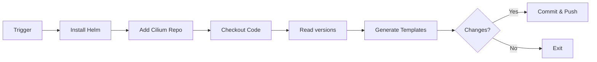
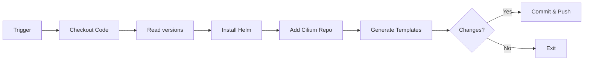

# GitHub Actions Workflows

This directory contains GitHub Actions workflows that automate version management and Helm template
generation for Cilium and Tetragon.

## Overview

| Workflow | Purpose | Trigger |
|----------|---------|---------|
| `update-versions.yml` | Auto-update Cilium/Tetragon versions | Daily, Manual |
| `cilium-helm.yml` | Generate Cilium Helm templates | Version changes, Manual |
| `tetragon-helm.yml` | Generate Tetragon Helm templates | Version changes, Manual |

---

## Update Versions Workflow

**File:** `update-versions.yml`

The workflow automatically checks for new releases of Cilium and Tetragon and creates pull requests when updates are available.

### Setup Instructions

To enable this workflow to create pull requests, you need to set up a Personal Access Token (PAT):

#### Option 1: Using a Personal Access Token (Recommended)

1. **Create a Personal Access Token**:
   - Go to GitHub Settings → Developer settings → Personal access tokens → Tokens (classic)
   - Click "Generate new token (classic)"
   - Give it a descriptive name like "talos-cilium-version-updater"
   - Select the following scopes:
     - `repo` (Full control of private repositories)
     - `workflow` (Update GitHub Action workflows)
   - Set an appropriate expiration date
   - Click "Generate token" and copy the token

2. **Add the token as a repository secret**:
   - Go to your repository Settings → Secrets and variables → Actions
   - Click "New repository secret"
   - Name: `PAT_TOKEN`
   - Value: Paste your personal access token
   - Click "Add secret"

3. **The workflow is now ready to use!**

#### Option 2: Using Fine-grained PAT (More Secure)

1. Go to GitHub Settings → Developer settings → Personal access tokens → Fine-grained tokens
2. Click "Generate new token"
3. Configure:
   - Token name: "talos-cilium-version-updater"
   - Repository access: Select "Only select repositories" → Choose this repository
   - Permissions:
     - Repository permissions:
       - Contents: Read and write
       - Pull requests: Read and write
       - Workflows: Read and write
4. Generate and add as `PAT_TOKEN` secret (same as Option 1, step 2)

### Testing the Workflow

Once set up, you can test the workflow:

1. Go to Actions tab in your repository
2. Select "Update Versions" workflow
3. Click "Run workflow" button
4. The workflow will check for updates and create a PR if new versions are available

### Workflow Schedule

The workflow runs automatically:

- **Daily at 00:00 UTC**
- Can also be triggered manually from the Actions tab

### Troubleshooting

#### Error: "GitHub Actions is not permitted to create or approve pull requests"

- This means the PAT token is not set up. Follow the setup instructions above
- The workflow will fall back to `GITHUB_TOKEN` which has this limitation

#### No PR is created

- Check the workflow logs to see if versions are already up to date
- Verify the PAT token has the correct permissions
- Ensure the token hasn't expired

---

## Cilium Helm Template Generator

**File:** `cilium-helm.yml`

This workflow generates Helm templates for Cilium and automatically commits them to the repository.
It creates three different template variants optimized for different deployment scenarios.

### What It Does

1. **Installs Helm CLI** and adds the Cilium Helm repository
2. **Reads the Cilium version** from the `versions` file
3. **Generates three template variants** in versioned directories:
   - `templates/cilium/{VERSION}/cilium-secure.yaml` - Secure configuration
   - `templates/cilium/{VERSION}/cilium.yaml` - Standard configuration with encryption
   - `templates/cilium/{VERSION}/cilium-single-node.yaml` - Single node configuration
4. **Updates the `latest` symlink** to point to the new version
5. **Commits and pushes** the generated templates and updated symlink back to the repository

### Triggers

The workflow runs automatically when:

- The `versions` file is modified (push to main)
- The workflow file itself is modified
- A pull request modifies either of these files
- Manually triggered from the Actions tab

### Generated Templates

Templates are organized in a versioned directory structure with `latest` symlinks: `templates/cilium/{VERSION}/`

For example, with Cilium version 1.17.6, the structure is:

```text
templates/cilium/
├── latest -> 1.17.6/
└── 1.17.6/
    ├── cilium-secure.yaml
    ├── cilium.yaml
    └── cilium-single-node.yaml
```

#### cilium-secure.yaml

Secure Cilium configuration using `$CILIUM_VALUES` environment variables.

#### cilium.yaml

Standard Cilium configuration with:

- `$CILIUM_VALUES` - Base configuration
- `$CILIUM_ENCRYPT` - Encryption settings

#### cilium-single-node.yaml

Single-node optimized configuration with:

- `$CILIUM_VALUES` - Base configuration
- `$CILIUM_SINGLE_OPERATOR` - Single operator settings

**Benefits of versioned structure with `latest` symlinks:**

- 🔄 Automatic updates - Talos patches reference `latest/` and automatically use new versions
- 📊 Track templates across different Cilium versions
- 🔍 Easy comparison between versions
- 📚 Historical templates remain available
- 🎯 Pin to specific versions when needed by changing the patch URL
- 🔙 Quick rollback by updating the symlink

### Configuration

The workflow uses environment variables for Helm values. These should be defined in the workflow file or as repository secrets/variables:

- `CILIUM_VALUES` - Base Helm values for all configurations
- `CILIUM_ENCRYPT` - Encryption-specific values
- `CILIUM_SINGLE_OPERATOR` - Single-node operator values

### Workflow Sequence



### Running Cilium Generator Manually

1. Go to **Actions** tab in your repository
2. Select **"Helm template generator for Cilium"**
3. Click **"Run workflow"**
4. Select the branch and click **"Run workflow"**

### Cilium Generator Troubleshooting

#### Cilium templates not generated

- Check that the `versions` file exists and is properly formatted
- Verify the Cilium version in `versions` is valid
- Check workflow logs for Helm errors

#### Cilium push fails

- Ensure the workflow has `contents: write` permission
- Verify there are no branch protection rules blocking the push
- Check for git conflicts

#### Wrong Cilium version generated

- Verify the `CILIUM_VERSION` in the `versions` file
- Check that the Cilium Helm chart version exists
- View available versions: `helm search repo cilium/cilium --versions`

---

## Tetragon Helm Template Generator

**File:** `tetragon-helm.yml`

This workflow generates Helm templates for Tetragon (Cilium's eBPF-based security observability tool)
and automatically commits them to the repository.

### Tetragon Generator Overview

1. **Checks out the repository** and reads the Tetragon version
2. **Installs Helm CLI** and adds the Cilium Helm repository
3. **Generates two template variants** in versioned directories:
   - `templates/tetragon/{VERSION}/tetragon.yaml` - Standard multi-node configuration
   - `templates/tetragon/{VERSION}/tetragon-single-node.yaml` - Single-node configuration (1 operator replica)
4. **Updates the `latest` symlink** to point to the new version
5. **Commits and pushes** the generated templates and updated symlink back to the repository

### Tetragon Triggers

The workflow runs automatically when:

- The `versions` file is modified (push to main)
- The workflow file itself is modified
- A pull request modifies either of these files
- Manually triggered from the Actions tab

### Tetragon Templates

Templates are organized in a versioned directory structure with `latest` symlinks: `templates/tetragon/{VERSION}/`

For example, with Tetragon version 1.4.1, the structure is:

```text
templates/tetragon/
├── latest -> 1.4.1/
└── 1.4.1/
    ├── tetragon.yaml
    └── tetragon-single-node.yaml
```

#### tetragon.yaml

Standard Tetragon configuration for multi-node clusters:

```bash
helm template tetragon cilium/tetragon \
  -n kube-system \
  --version ${TETRAGON_VERSION} \
  --namespace kube-system
```

#### tetragon-single-node.yaml

Single-node optimized configuration:

```bash
helm template tetragon cilium/tetragon \
  -n kube-system \
  --version ${TETRAGON_VERSION} \
  --set operator.replicas=1 \
  --namespace kube-system
```

**Benefits of versioned structure with `latest` symlinks:**

- 🔄 Automatic updates - Talos patches reference `latest/` and automatically use new versions
- 📊 Track templates across different Tetragon versions
- 🔍 Easy comparison between versions
- 📚 Historical templates remain available
- 🎯 Pin to specific versions when needed by changing the patch URL
- 🔙 Quick rollback by updating the symlink

### Tetragon Configuration

The workflow reads `TETRAGON_VERSION` from the `versions` file:

```text
TETRAGON_VERSION=1.4.1
```

### Tetragon Workflow Sequence



### Running Tetragon Generator Manually

1. Go to **Actions** tab in your repository
2. Select **"Helm template generator for Tetragon"**
3. Click **"Run workflow"**
4. Select the branch and click **"Run workflow"**

### Tetragon Generator Troubleshooting

#### Tetragon templates not generated

- Check that the `versions` file exists and is properly formatted
- Verify the Tetragon version in `versions` is valid
- Check workflow logs for Helm errors

#### Tetragon push fails

- Ensure the workflow has `contents: write` permission
- Verify there are no branch protection rules blocking the push
- Check for git conflicts

#### Wrong Tetragon version generated

- Verify the `TETRAGON_VERSION` in the `versions` file
- Check that the Tetragon Helm chart version exists
- View available versions: `helm search repo cilium/tetragon --versions`

---

## Workflow Integration

These workflows work together to provide automated version management and template generation:

### Typical Flow

1. **Daily automated check**: `update-versions.yml` runs and detects new Cilium/Tetragon releases
2. **PR created**: A pull request is automatically created with updated `versions` file
3. **Review & merge**: You review and merge the PR
4. **Templates generated**: The merge triggers `cilium-helm.yml` and `tetragon-helm.yml`
5. **Templates committed**: Updated Helm templates are committed to the repository

### Manual Updates

If you prefer to update versions manually:

1. Edit the `versions` file
2. Commit and push to main
3. The Helm template generators will run automatically
4. Templates are updated and committed

### Best Practices

- **Review PRs**: Always review auto-generated PRs before merging
- **Check release notes**: Review upstream release notes for breaking changes
- **Test templates**: Test generated templates in a dev environment before deploying
- **Pin versions**: Keep versions pinned in the `versions` file for reproducibility
- **Monitor workflows**: Check workflow runs regularly for failures

### Environment Variables

For the Cilium workflow to work properly, you may need to set these as repository variables:

```yaml
CILIUM_VALUES: |
  --set key1=value1
  --set key2=value2

CILIUM_ENCRYPT: |
  --set encryption.enabled=true

CILIUM_SINGLE_OPERATOR: |
  --set operator.replicas=1
```

Go to **Settings → Secrets and variables → Actions → Variables** to add these.

---

## Getting Help

- **Workflow fails**: Check the Actions tab for detailed logs
- **Template issues**: Review the Helm chart documentation:
  - [Cilium Helm Chart](https://github.com/cilium/cilium/tree/main/install/kubernetes/cilium)
  - [Tetragon Helm Chart](https://github.com/cilium/tetragon/tree/main/install/kubernetes/tetragon)
- **Version problems**: Verify versions exist in upstream repositories
- **Permission errors**: Check workflow permissions and PAT token setup
