# Security Gate Process

This document explains how the pre-commit container image build workflow
implements security gates to ensure only secure images are published.

## Workflow Overview

```mermaid
graph TD
    A[Code Push/PR] --> B[Build Local Image]
    B --> C[Trivy Security Scan]
    C --> D{CRITICAL/HIGH<br/>Vulnerabilities?}
    D -->|Yes| E[❌ Fail Workflow]
    D -->|No| F[✅ Upload Scan Results]
    E --> G[Upload to Security Tab]
    F --> H{Is Main Branch?}
    H -->|No - PR| I[End - No Push]
    H -->|Yes| J[Build Multi-Arch]
    J --> K[Push to GHCR]
    K --> L[Generate SBOM]
    L --> M[Sign with Cosign]
```

## Security Gate Details

### 1. Pre-Publication Scanning

Images are **always scanned before publication**:

- Build happens locally first (single architecture)
- Trivy scans for CRITICAL and HIGH severity vulnerabilities
- If vulnerabilities found: workflow fails, image is NOT pushed
- Scan results uploaded to GitHub Security tab regardless of outcome

### 2. Multi-Architecture Build

Only triggered if security scan passes:

- Rebuilds for `linux/amd64` and `linux/arm64`
- Uses build cache for efficiency
- Pushes to GitHub Container Registry
- Only happens on main branch (never on PRs)

### 3. Post-Publication Security Artifacts

After successful push:

- **SBOM Generation**: Software Bill of Materials in SPDX format
- **Cosign Signing**: Cryptographic signature for supply chain verification
- Both only run if image was successfully pushed

## What This Prevents

✅ Publishing vulnerable container images
✅ Accidental deployment of insecure dependencies
✅ Supply chain attacks through compromised base images
✅ Pushing images from pull requests

## What Happens When Scans Fail

When Trivy detects CRITICAL or HIGH vulnerabilities:

1. ❌ Workflow fails at the scan step
2. 📊 Results are uploaded to GitHub Security tab
3. 🚫 Image is NOT pushed to GHCR
4. 📝 Previous "latest" tag remains unchanged
5. �� GitHub notifications alert maintainers

## How to Fix Failed Scans

1. Check GitHub Security tab for vulnerability details
2. Update vulnerable dependencies:
   - Update Python base image version
   - Update yamlfmt version
   - Update pre-commit version
3. Push changes - workflow will re-run
4. Once scan passes, image is automatically published

## Override Capabilities

There is **NO override mechanism** by design. This ensures:

- All published images are security-vetted
- No human error can bypass security checks
- Audit trail through GitHub Actions logs

## Monitoring

Track security posture through:

- **GitHub Security Tab**: View all vulnerability reports
- **Actions Tab**: See workflow run history and failures
- **SBOM Artifacts**: Download detailed dependency information
- **Cosign Verification**: Verify image signatures

## Compliance

This workflow supports:

- Supply chain security requirements (SBOM)
- Vulnerability management policies
- Image signing and verification standards
- Audit trail requirements (all scans logged)
